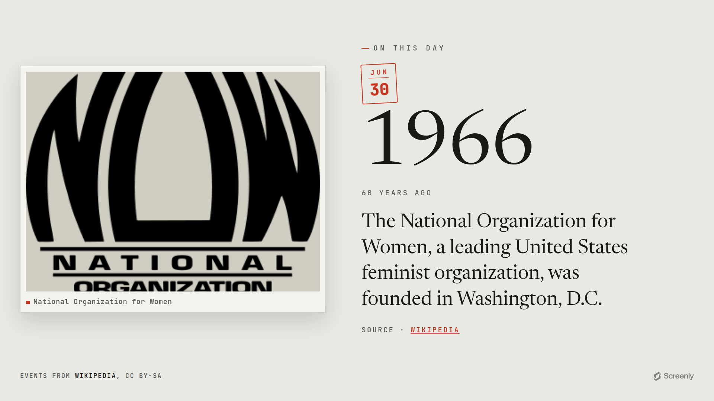

# Screenly On This Day App

A clean, full-screen historical moment for digital signage. On each load it shows
one notable event from this day in history — drawn live from Wikipedia — set in
the "The Record" style: today's date pressed in as a cinnabar stamp, the year it
happened standing as the hero in a light Newsreader serif, and the source article
mounted beside it like a tipped-in photographic plate.



Live: **https://on-this-day.srly.io**

Part of the Screenly signage family alongside the [quotes](../quotes),
[weather](../weather-app), and [clock](../clock-app) apps. Like `quotes`, this one
is a fully **static** site hosted on **GitHub Pages** — no server. The data is
fetched from Wikipedia in the browser.

## Stack

- **Bun** — package manager, bundler, and test runner (no npm/npx)
- **TypeScript** — all app JS, strict mode (no hand-written JS in `assets/`)
- **Tailwind CSS v4** — CSS-first config (`@theme`), compiled by the Tailwind CLI
- **Biome** — lint + format
- Self-hosted variable fonts (Newsreader, JetBrains Mono), vendored from `@fontsource`

## Develop

```sh
bun install        # install deps (fonts get vendored during build)
bun run dev        # build, then serve dist/ locally
bun run build      # build the static site into dist/
bun test           # run unit + dataset tests
bun run typecheck  # tsc --noEmit
bun run lint       # Biome (lint:fix / format to auto-fix)
```

`bun run build` is non-destructive: it assembles everything into `dist/`
(gitignored) — copies `index.html` + static assets, compiles Tailwind, bundles
the TypeScript, stamps a content-hash `?v=` onto asset URLs for cache-busting,
and writes the `CNAME`.

## Where the data comes from

Each load fetches the **Wikipedia "On this day" REST feed** for the viewer's
local date:

```
https://en.wikipedia.org/api/rest_v1/feed/onthisday/selected/MM/DD
```

It's served with open CORS, so the static page calls it directly — no server,
no API key. The app prefers an event that has an article image, upscales the
thumbnail for large screens, and renders it.

If the feed is unreachable (offline signage, an API hiccup), the app falls back
to a small bundled set of ~14 famous, fact-checked events in
[`assets/static/data/fallback.json`](assets/static/data/fallback.json) — each
links a real Wikipedia article — and finally to one inlined event, so the screen
is never blank.

## Attribution & licensing

Event text and images come from **[Wikipedia](https://en.wikipedia.org)** and are
licensed **[CC BY-SA](https://creativecommons.org/licenses/by-sa/4.0/)**. Every
screen credits Wikipedia: a `Source · Wikipedia` link to the specific article,
plus a standing "Events from Wikipedia, CC BY-SA" colophon. The app's own code is
AGPL-3.0-only (see below).

## Supported resolutions

The layout is fluid (one `clamp()`-driven root size, orientation-neutral). Verified
landscape **and** portrait across:

| Resolution | Notes |
| --- | --- |
| 4096×2160 · 3840×2160 (+ portrait) | 4K |
| 1920×1080 (+ portrait) | 1080p |
| 1280×720 (+ portrait) | 720p |
| 800×480 (+ portrait) | Raspberry Pi Touch Display |

## Deploy

Push to `master` runs `.github/workflows/deploy-pages.yml`, which builds and
publishes `dist/` to GitHub Pages. CI (`ci.yml`) typechecks, lints, tests, and
builds on every PR.

One-time setup (outside this repo):

1. **DNS:** `CNAME` record `on-this-day.srly.io → screenly-labs.github.io`.
2. **Repo → Settings → Pages:** Source = "GitHub Actions"; set the custom domain
   to `on-this-day.srly.io` and enable "Enforce HTTPS" once the certificate
   provisions.

## License

AGPL-3.0-only (see `LICENSE`). Event content is from Wikipedia, CC BY-SA.
